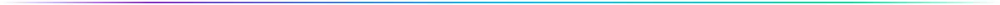

<!--
  ============================================================
  GitHub Profile README — Lokesh Parate
  ============================================================
  SETUP: replace the following placeholders throughout this file
  before publishing:
    - lokikun-glitch  → lokikun-glitch
    - https://www.linkedin.com/in/lokesh-parate-1a41b1272/     → https://www.linkedin.com/in/lokesh-parate-1a41b1272/
    - lokeshparate6@gmail.com            → lokeshparate6@gmail.com
  This file must live in a repository named exactly your
  GitHub username (e.g. github.com/lokikun-glitch/lokikun-glitch)
  for GitHub to render it on your profile page.
  ============================================================
-->

 

 

 

## 👋 About Me

I'm passionate about building **AI-powered applications**, intelligent automation systems, scalable backend services, and modern web applications. I enjoy solving challenging real-world problems through technology, participating in hackathons, and continuously learning new technologies.

<table>
<tr>
<td valign="top" width="50%">

**🔭 Currently focused on**
AI agents, LLM-powered applications, and full-stack product engineering

**🌱 Actively exploring**
LangChain, Retrieval-Augmented Generation, and edge AI (ESP32 / on-device ML)

</td>
<td valign="top" width="50%">

**🤝 Open to**
Collaborating on AI/ML and full-stack open-source projects

**⚡ Fun fact**
I enjoy turning weekend hackathon ideas into working prototypes

</td>
</tr>
</table>

## 🛠️ Tech Stack

**Programming Languages**

**Frontend**

**Backend**

**AI / Machine Learning**

**Databases**

**DevOps & Tools**

## 🚀 Featured Projects

### 🔹 WhatsApp AI Notification Router
Intelligent notification routing system that uses LLMs to classify, prioritize, and forward WhatsApp messages to the right channel or automation pipeline in real time.

---

### 🔹 ESP32 Wi-Fi CSI Human Activity Detection
Edge sensing project that leverages Wi-Fi Channel State Information (CSI) captured on an ESP32 to detect and classify human activity without cameras, combined with a lightweight ML classifier.

---

### 🔹 AI Chat Applications
A collection of production-style conversational AI apps featuring retrieval-augmented generation, memory, and multi-model support (OpenAI, Ollama, Hugging Face) behind a unified chat interface.

---

### 🔹 Docker & DevOps Labs
A hands-on collection of containerized environments, multi-service Docker Compose setups, and CI/CD pipeline experiments used to sharpen production deployment workflows.

---

### 🔹 Full Stack Web Applications
End-to-end web applications built with modern JavaScript frameworks, RESTful backends, and relational/NoSQL databases — covering auth, dashboards, and real-time features.

## 📊 GitHub Stats

 

### 📈 Contribution Graph

### 🐍 Contribution Snake

<picture>
  <source media="(prefers-color-scheme: dark)" srcset="https://raw.githubusercontent.com/lokikun-glitch/lokikun-glitch/output/github-contribution-grid-snake-dark.svg" />
  <source media="(prefers-color-scheme: light)" srcset="https://raw.githubusercontent.com/lokikun-glitch/lokikun-glitch/output/github-contribution-grid-snake.svg" />
  
</picture>

Generated daily by <code>.github/workflows/snake.yml</code> — see setup notes below.

### 🏆 GitHub Trophies

<!-- Trophies are temporarily disabled due to API limits (402 Payment Required) -->
<!--  -->

## 📚 Current Learning

## 🌍 Open Source Interests

I'm interested in contributing to and building open-source tools around **LLM tooling & agent frameworks**, **developer productivity utilities**, and **lightweight edge/IoT ML projects**. Always happy to collaborate — feel free to open an issue or reach out.

## 📫 Connect with Me

## 🎯 Fun Facts

- 🧩 I enjoy turning weekend hackathon ideas into working prototypes
- 🤖 I've built projects spanning AI agents, edge ML, and full-stack apps
- ⚡ I care about clean, maintainable code as much as shipping fast
- 📡 Sensor data and signal processing fascinate me almost as much as LLMs

## 💬 Quote

 

